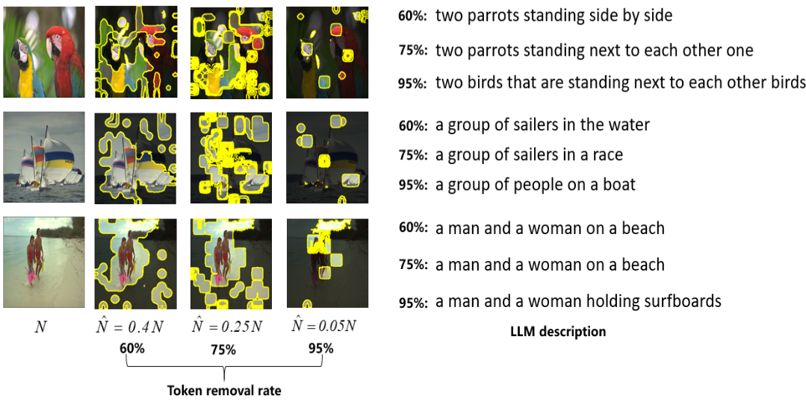
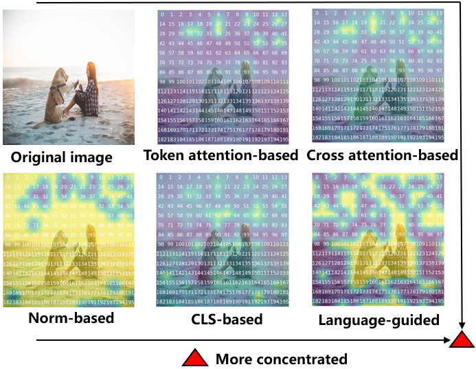
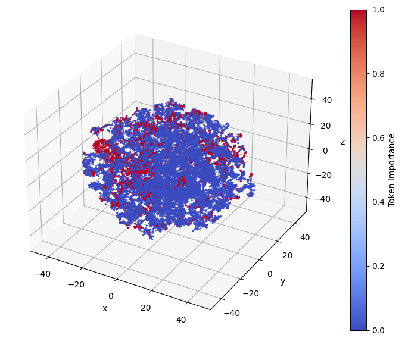
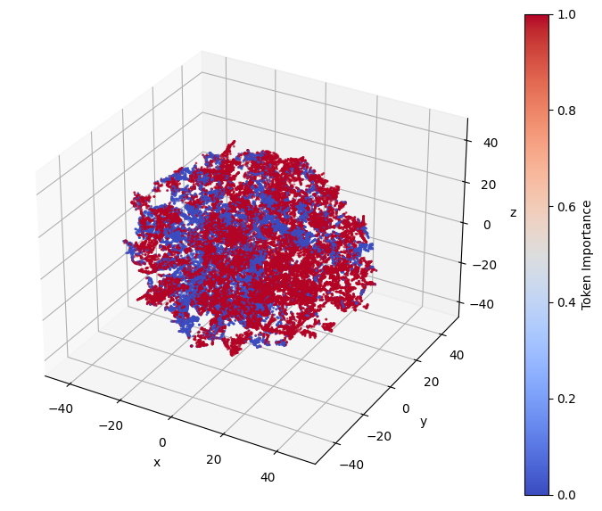

# Token Space Analysis and Vision Token Compression for Large Vision-Language Models
Test code for articles submitted to IEEE Transactions on Mobile Computing
This repository is built on the Token Space Analysis and Vision Token Compression for Large Vision-Language Models

## Requirements
Dependencies can be found in requirements.txt

## Download the pre-trained codebook or model from the link below and place them in the designated directory: 
Pre-trained BLIP weights and BERT need to be downloaded before running. [BLIP]: (https://github.com/salesforce/BLIP) #In this paper, the BLIP w/ ViT-B is used.
[BERT]:(https://drive.google.com/drive/folders/1pZAzqDwhJMvo_N9JPB1pANfjMkNlqfGe?usp=drive_link). The BERT weights should be placed in the BERT folder.
In order to run the feature coding for machine algorithm proposed in this paper, it is also necessary to download the codebook：
[codebook]:(https://drive.google.com/file/d/1jv3pt70uSgXHUaRnpFujRQKNYIpAdNC0/view?usp=drive_link)

## Data preparation
Please place your dataset files as follows before running any scripts:

flick/ ├── annotation/ │ └── <annotation files> └── flickr30k-images/ └── flickr30k-images/ └── <image files>

- **annotation/**: Contains all annotation files.
- **flickr30k-images/**: The main folder for the Flickr30k dataset images.
  - **flickr30k-images/**: Subfolder with the actual image files.

Make sure to update the dataset paths in your configuration or script parameters accordingly. Also be careful to modify the path in retrieval_flickr.yaml.
## Test hybird progressive token compression

To generate a caption for an image with the semantic-aware quantizaiton and MDC coding (The sparsity_percentage is control the \hat{N}):

<pre> python static_image_caption_hybird.py  </pre> 

After running, some results will be output as follows:

flickr30k-images/1921102799.jpg 100 ['a young boy playing with a soccer ball']

flickr30k-images/2504007911.jpg 200 ['a person riding a bike in front of a building']

flickr30k-images/2900560501.jpg 300 ['a group of people at a restaurant']

flickr30k-images/327955368.jpg 400 ['a young boy playing in the leaves']

flickr30k-images/3671851846.jpg 500 ['a woman standing in a field']

To perform image retrieval with the semantic-aware quantizaiton and MDC coding  (The sparsity_percentage is control the \hat{N})：
<pre> python replace_retrieval_codebook_bpp_hybird.py  </pre> 

After running, some results will be output as follows:

{"test_txt_r1": 74.1, "test_txt_r5": 92.1, "test_txt_r10": 94.5, "test_txt_r_mean": 86.89999999999999, "test_img_r1": 70.26, "test_img_r5": 90.26, "test_img_r10": 94.56, "test_img_r_mean": 85.02666666666667, "test_r_mean": 85.96333333333334}
## LDPC BLER Data Acquisition 
ldpc-5-g-nr-master.zip LDPC-5G-NR.exe -K 1024  -R 0.5 -BP

## follow-up work
After the review finished, the semantic eyes analysis and language-guided training code will be updated one after another

## Some renderings based on the language-guided visual token compression proposed in this paper
 [Visual interpretation]
---

 [Visual interpretation1]
---

##The t-sne result
 [Language-based]
---

 [Norm-based]
---

